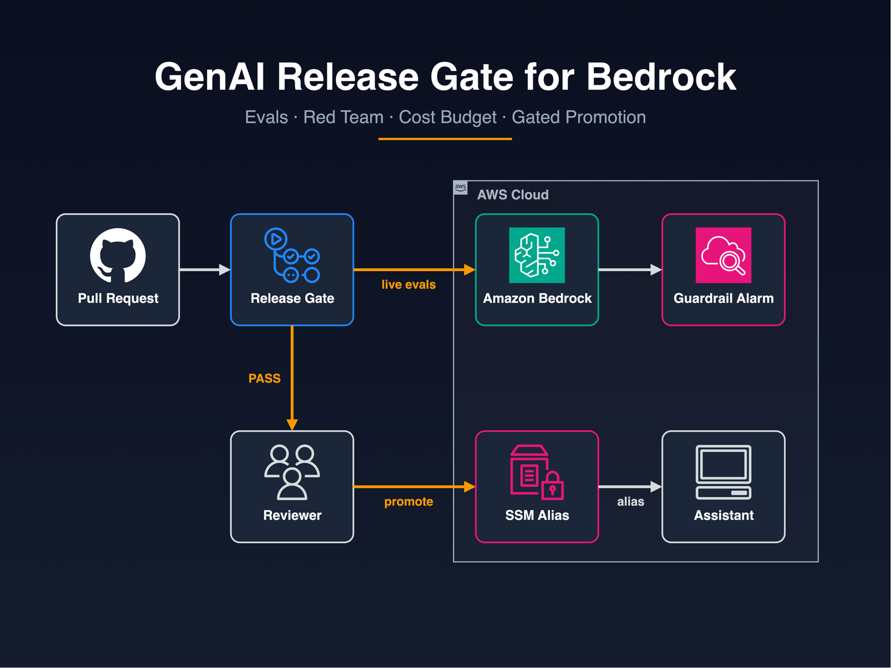
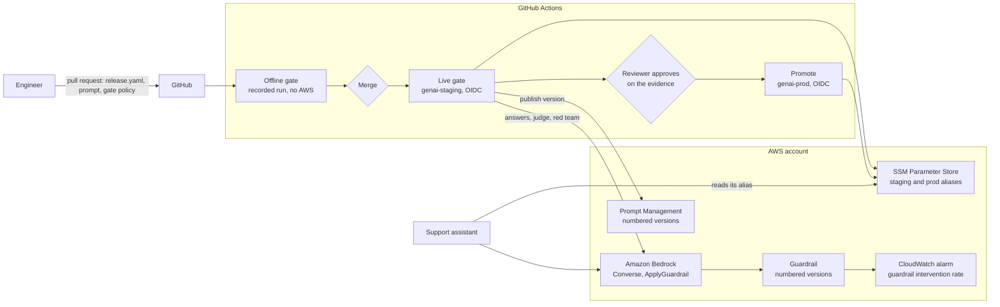

# GenAI release pipeline and evaluations on Amazon Bedrock

A CI release gate that blocks prompt, model or guardrail changes that fail quality evaluation, red-team or cost checks,
with a GitHub Actions pipeline, Terraform for the serving configuration, and evaluation fixtures you can verify
offline.

[](https://github.com/gamaware/bedrock-genaiops-release-gate-lab/actions/workflows/ci.yml)
[](LICENSE)




> **Lab.** Harbor Goods and all data here are fictional. Each repository in this portfolio is a
> separate engagement with Harbor Goods, a fictional mid-size retailer. Account IDs are AWS documentation examples.

## What this proves

- **Every answer-changing input is pinned and gated.** One `release.yaml` pins the model, the Prompt Management
  version and template hash, the guardrail version and the knowledge base. A pull request that changes any of them
  goes through four checks: release integrity, answer quality, red team, and cost and latency.
- **Decisions come from numbers in the repository.** Thresholds live in [`gate/policy.yaml`](gate/policy.yaml) and
  prices in [`gate/models.yaml`](gate/models.yaml). The gate compares the candidate with the production baseline, so
  a regression blocks the release even when the absolute score still looks fine.
- **Six recorded changes, six correct verdicts.** A prompt tweak passes. A cheaper model that answers worse, a
  guardrail that stops masking phone numbers, a model upgrade that triples the cost, a model nobody approved, and
  evidence recorded for a different release are each blocked, and each one explains why in the
  [release evidence](report/evidence/).
- **The gate fails closed.** A missing answer, a score out of range, a judge reply that is not valid JSON, or a run
  recorded for another release is a blocked release (exit code 2), never a pass.
- **Keyless, gated promotion with rollback.** Pull requests run offline with no cloud access. A manual live gate on
  staging and an approved promotion to production use two OIDC roles, each limited to one GitHub environment.
  SSM Parameter Store history makes rollback one command.
- **Tested without an AWS account:** 75 pytest tests (Bedrock adapters through botocore's Stubber), 13 mocked
  `terraform test` runs, Checkov, Trivy, Semgrep, Ruff, actionlint and zizmor, all behind one `make verify`.

## Inspect the deliverable

| Artifact | Why look |
| --- | --- |
| [`report/REPORT.md`](report/REPORT.md) ([PDF](report/REPORT.pdf)) | The client report: what the gate decided, cost per request, risks |
| [`report/evidence/`](report/evidence/) | The release evidence the gate writes for each change, as a reviewer sees it |
| [`release/candidate/release.yaml`](release/candidate/release.yaml) | Everything that changes an answer, pinned |
| [`gate/policy.yaml`](gate/policy.yaml) | The thresholds that decide a release |
| [`src/genai_gate/checks.py`](src/genai_gate/checks.py) | The four checks, pure functions over recorded runs |
| [`.github/workflows/release-gate.yml`](.github/workflows/release-gate.yml) | Offline gate on PRs, live gate on staging, approved promotion |
| [`evals/`](evals/) | Golden questions, red-team prompts and the judge rubric, reviewable as data |
| [`infra/terraform/release-gate/`](infra/terraform/release-gate) | Guardrail and version, managed prompt, SSM aliases, roles, alarm |

## Scenario and acceptance criteria

Harbor Goods, a fictional mid-size retailer, answers customer questions with an assistant on Amazon Bedrock:
retrieved policy text, a managed prompt, Amazon Nova Lite and a guardrail. After go-live the team changes prompts,
models, guardrail settings and chunking every few weeks. Each change can quietly make answers worse, weaken safety or
raise the bill, and nobody can say afterwards which configuration served a given answer.

They want a release gate: no prompt, model or guardrail change reaches production unless it passes quality, safety
and cost checks, with an audit trail and a fast way back.

Constraints: GitHub Actions, no long-lived AWS keys, one AWS account with a staging and a production alias, and a
platform team that reviews Terraform and YAML.

| Acceptance criterion | How it is met | Checked by |
| --- | --- | --- |
| A change that lowers answer quality is blocked | Judge scores against minimums and against the baseline; critical questions scored one by one | `make test`, scenario `model-swap-quality-regression` |
| A change that weakens safety is blocked | Deterministic red-team scoring; any prompt the baseline handled safely must stay safe | `make test`, scenario `guardrail-loosened-redteam` |
| A change that breaks the cost or latency budget is blocked | Cost per 1,000 requests from tokens and guardrail text units; p95 latency | `make test`, scenario `model-upgrade-over-budget` |
| Only approved models reach production | Allowlist in `gate/models.yaml`; IAM allows only allowlisted model ARNs | `make test`, `terraform test` |
| Evidence belongs to the release under review | Release digest and evaluation-set digests in every run manifest | `make test`, scenario `stale-evidence` |
| Pull requests never touch AWS | Offline gate job has no `id-token` permission | zizmor, Checkov, workflow review |
| Production changes are approved and reversible | `genai-prod` environment with a reviewer; SSM parameter history and `scripts/rollback.sh` | `make test-live` |

## Architecture



Every pull request that touches a release input runs the offline gate on the recorded run in `release/candidate/`.
After merge, a maintainer starts the live gate. It sends the golden and red-team sets through the real serving path
(input guardrail, pinned model with the pinned prompt, output guardrail), scores answers with an LLM judge, gates the
result and writes the staging alias. The production promotion waits for a reviewer, who approves on the evidence
artifact. The application reads its alias from SSM Parameter Store, so promotion and rollback need no deployment. A
CloudWatch alarm on the guardrail intervention rate tells on-call when a release starts blocking normal questions or
an attack is under way.

## Verify locally

Prerequisites (versions used to verify this repo):

| Tool | Version |
| --- | --- |
| Python | 3.13 (through uv) |
| uv | 0.12 or later |
| Terraform | 1.14.5 |
| tflint | 0.61.0 (AWS ruleset 0.49.0, fetched by `tflint --init`) |
| Checkov | 3.3.19 (run through `uvx`) |
| Semgrep | 1.178.0 (run through `uvx`) |
| Ruff | 0.16.9 (run through `uvx`) |
| Trivy | 0.74.0 |
| shellcheck, shellharden | 0.11, 4.3.2 |
| jq | 1.7 or later |

```bash
make verify
```

The run needs no AWS credentials and makes no AWS API calls. The first run downloads the Python packages, the
Terraform provider, the tflint ruleset, Semgrep rules and the Trivy database. The run ends with:

```text
verify: all checks passed
```

To see the gate decide, run `make scenarios`:

```text
scenario                         expected actual
guardrail-loosened-redteam       BLOCK    BLOCK
model-not-allowlisted            BLOCK    BLOCK
model-swap-quality-regression    BLOCK    BLOCK
model-upgrade-over-budget        BLOCK    BLOCK
prompt-tweak-pass                PASS     PASS
stale-evidence                   BLOCK    BLOCK
```

`make help` lists the individual targets. A real end-to-end test is available as `make test-live`. It is manual and
runs only in the maintainer's personal sandbox account: it applies the stack, records a live run with Amazon Nova
Lite, gates it, promotes and rolls back the staging alias, and destroys everything on exit
([docs/live-test.md](docs/live-test.md)).

## Repository map

```text
release/
  production/           baseline: release.yaml, prompt.txt, recorded run
  candidate/            the change under review, same layout
gate/                   policy.yaml (thresholds), models.yaml (allowlist and prices)
evals/                  golden-set.jsonl, redteam-set.jsonl, rubric.md
fixtures/scenarios/     six recorded changes with their expected verdicts
src/genai_gate/         the gate: loaders, checks, evidence, Bedrock adapters, CLI
tests/                  pytest suites (offline)
infra/terraform/
  release-gate/         guardrail, prompt, SSM aliases, KMS, evaluation bucket, roles, alarm
    tests/              mocked terraform test suites
scripts/                scenarios, promote, rollback, live test, report build
report/                 REPORT.md and PDF, evidence/ per scenario
docs/                   adr/, runbook.md, live-test.md
.github/workflows/      ci.yml, release-gate.yml, rollback.yml, scorecard.yml
Makefile                one entry point for local and CI runs
```

## Decisions and trade-offs

Architecture decision records follow the *Fundamentals of Software Architecture* (2nd ed.) format.

| Number | Title | Status |
| --- | --- | --- |
| [0001](docs/adr/0001-gate-recorded-runs-on-pull-requests.md) | Gate recorded runs on pull requests, live runs only after merge | Accepted |
| [0002](docs/adr/0002-one-release-file-bound-by-digest.md) | One release file, bound to its evidence by digest | Accepted |
| [0003](docs/adr/0003-the-gate-fails-closed.md) | The gate fails closed | Accepted |
| [0004](docs/adr/0004-deterministic-red-team-llm-judge-for-quality.md) | Deterministic red-team scoring, LLM judge for quality only | Accepted |
| [0005](docs/adr/0005-promotion-through-ssm-aliases.md) | Promotion and rollback through SSM Parameter Store aliases | Accepted |
| [0006](docs/adr/0006-numbered-versions-only.md) | Numbered prompt and guardrail versions only | Accepted |
| [0007](docs/adr/0007-guardrail-units-in-the-cost-budget.md) | Guardrail text units count toward the cost budget | Accepted |
| [0008](docs/adr/0008-live-tests-in-a-personal-sandbox.md) | Live tests only in a personal sandbox account | Accepted |

## Security and quality gates

| Gate | Runs in | Why |
| --- | --- | --- |
| Release gate on the candidate | `make gate`, `release-gate.yml` offline job | The pull request check a client would run |
| Recorded scenarios | `make scenarios`, `make test` | The gate blocks what it should and passes what it should |
| pytest | `make test`, CI `verify` job | Gate rules, loaders, CLI exit codes, Bedrock adapters through botocore's Stubber |
| Ruff | `make python`, pre-commit | Python lint, including the bandit (`S`) rules, and formatting |
| Terraform fmt, validate, tflint, `terraform test` | `make terraform`, shared `terraform` workflow | Syntax, AWS lint, and the guarantees in the acceptance table |
| Checkov | `make checkov`, shared `security` workflow | Policy checks on Terraform and workflows; skips carry reasons in the code |
| Trivy | `make trivy`, shared `security` workflow | Misconfigurations and secrets |
| Semgrep | `make semgrep`, shared `security` workflow | Static analysis of Python, Terraform and workflows |
| gitleaks, detect-secrets | pre-commit, shared `secrets` workflow | No credentials in the history |
| actionlint, zizmor | `make workflows`, pre-commit, shared `lint-actions` workflow | Workflow correctness and hardening |
| Report freshness | `make report-check` | The committed PDF was built from the current Markdown |
| OpenSSF Scorecard | `scorecard.yml` | Repository supply-chain posture |

Workflows start from `permissions: {}`, pin actions by SHA and set timeouts. Pull request jobs get no cloud access.

## Limits and production adaptations

- **Simulated:** no AWS account backs this repository's CI. The recorded runs are fixtures written for this lab, not
  output from a real model; `make test-live` records a real run by hand. The mocked Terraform tests prove
  configuration intent, not IAM behaviour or quotas.
- **Judge variance:** an LLM judge is not deterministic. The live gate uses temperature 0 and a fixed rubric, and the
  thresholds leave a margin; a real engagement calibrates the judge against human labels before trusting it.
- **Small sets:** 12 golden questions and 12 red-team prompts show the mechanism. A client set starts at 50 to 100
  questions drawn from real tickets, reviewed by support leads.
- **Out of scope:** the knowledge base itself (see `terraform-aws-bedrock-rag-lab`), the GitHub OIDC provider (see
  [github-actions-aws-oidc-lab](https://github.com/gamaware/github-actions-aws-oidc-lab)), model invocation logging
  (an account-wide setting), and online evaluation of production traffic.
- **A real engagement adds:** Amazon Bedrock evaluation jobs for larger sets (the evaluator role and bucket are
  already here), separate staging and production accounts, AgentCore Evaluations online configuration for agents,
  and a dashboard of gate verdicts over time.
- **Cost to run:** the offline gate costs nothing. A live gate of 24 prompts plus judge calls costs cents with Nova
  Lite. The stack itself is a KMS key, two SSM parameters, one alarm and an almost empty bucket, about USD 1.50 a month
  in `us-east-1`.

## Built on

Ideas, not code, come from these sources. No file here is copied from them.

- [Amazon Bedrock Workshop](https://github.com/aws-samples/amazon-bedrock-workshop) (MIT-0): Converse and guardrail
  invocation patterns.
- [agentcore-samples](https://github.com/awslabs/agentcore-samples), `01-features/06-observe-evaluate-optimize-your-agent`
  (Apache-2.0): evaluation stages and online evaluation.
- [agent-evaluation](https://github.com/awslabs/agent-evaluation) (Apache-2.0): LLM-judged test design.
- [sample-bedrock-guardrails-cloudwatch](https://github.com/aws-samples/sample-bedrock-guardrails-cloudwatch) (MIT-0):
  guardrail metrics and alarms.
- AWS Prescriptive Guidance,
  [GenAIOps pre-production hardening](https://docs.aws.amazon.com/prescriptive-guidance/latest/gen-ai-lifecycle-operational-excellence/preprod-hardening.html),
  and the [Well-Architected Generative AI Lens](https://docs.aws.amazon.com/wellarchitected/latest/generative-ai-lens/)
  (GENOPS04-BP02): method, cited.
- [Creating Responsible AI With Amazon Bedrock Guardrails](https://catalog.workshops.aws/bedrockguard/en-US/amazon-bedrock-guardrails)
  (workshop): guardrail policy design, cited only.

## Related work

Part of the [AWS DevOps portfolio](https://github.com/gamaware/aws-devops-portfolio), under the service
[GenAI release pipeline and evaluations on Upwork](https://www.upwork.com/freelancers/~014b3520cf9e140103). The
keyless deploy roles and workflow hardening come from
[github-actions-aws-oidc-lab](https://github.com/gamaware/github-actions-aws-oidc-lab).

## License

[MIT](LICENSE)
